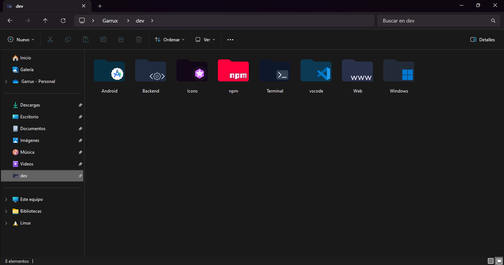
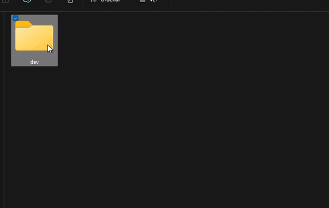

# Garrux Swam icons

Paquete de iconos para usar en tus directorios de windows y darle una apariencia mas personalizada y atractiva. 

Ejemplo: 

## Iconos disponibles 

| Nombre   | Icono                                          | Nombre       | Icono                                              |
| -------- | ---------------------------------------------- | ------------ | -------------------------------------------------- |
| npm      |       | web          |           |
| pnpm     |      | backend      |       |
| dev      |       | android      |       |
| yarn     |      | vscode       |        |
| bun      |       | github       |        |
| electron |  | gitlab       |        |
| linux    |     | javascript   |    |
| admin    |     | typescript   |    |
| golang   |    | home         |          |
| react    |     | react-native |  |
| test     |      | windows      |       |
| trash    |     | icons        |         |
| logs     |      | astro        |         |
| python   |    | api          |           |
| node     |      | deno         |          |
| css      |       | src          |           |
| svelte   |    | sass         |          |
| angular  |   | nestjs       |        |
| secure   |    | keys         |          |
| guard    |     | graphql      |       |
| nginx    |     | temp         |          |
| vue      |       | next         |          |

## Configurar

Actualmente la manera de configurarlo es darle click derecho a la carpeta que quieres personalizar, darle click derecho, propiedades, personalizar, cambiar icono y buscas y seleccionas el icono donde los hayas guardado. 

